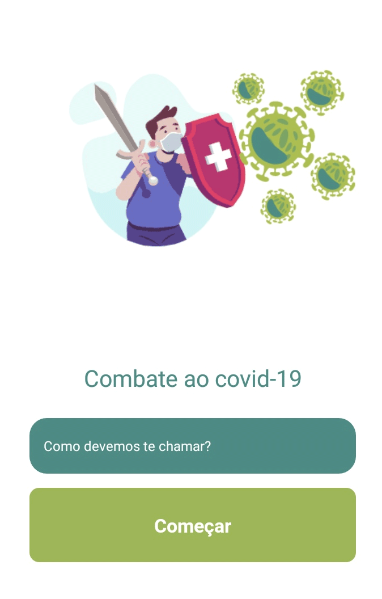

<p align="center">
   
</p>

# Combate ao covid-19

This project is part of the "Desenvolvendo um app para ajudar no combate a covid-19" from [Marcus Henrique](https://www.youtube.com/channel/UC3ZaLCltfI-34EQaZmWFaeg) course and consists on app that users can earn points for taking care against the corona virus.


We mainly use [React Native](https://reactnative.dev/) . 

---

# Guide

* [Features](#features)
* [Installation](#installation)
* [Technologies](#technologies)
* [Future Implementations](#future-implementations)


# Features

*  Users can earn points if they follow the care.


# Installation

**You will need install:**

 [Node.js](https://nodejs.org/en/download/) <br />
 [Npm](https://www.npmjs.com/) 

**Cloning repository**

```git clone https://github.com/cledman/combatcovid19.git```

**Install dependencies**

```npm install```


**Go to the folder and:**

```npm start```

**Go to the Frontend folder and:**

```npm start```


# Technologies

* [NodeJS](https://nodejs.org/en/) to handle the server, 
* [React Native](https://reactnative.dev/) to handle the rendering

# Future Implementations

Under construction.

Thanks to [Marcus Henrique](https://github.com/marcoshenrique-dev)!!!
##
